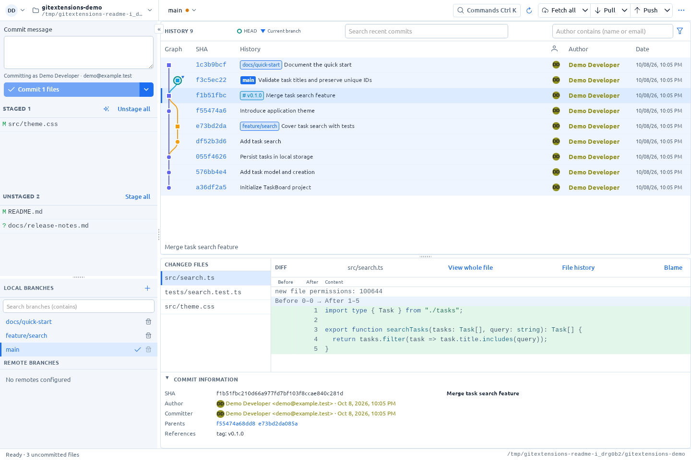

# Git Extensions Linux

[English](README.md) | Русский

Спасибо создателям и участникам [оригинального Git Extensions](https://github.com/gitextensions/gitextensions) за удобный Git-клиент и открытый исходный код.
Этот проект создан с помощью нейросетей. Это самостоятельная Linux-версия на Go/Wails и Vue, с адаптированными частями оригинала.


Локальный Git-клиент для Linux: граф коммитов, работа с изменениями и просмотр файлов. Отдельный сервер и аккаунт не нужны.



Скриншот Linux-приложения с тестовым репозиторием: история, ветки, локальные изменения и diff выбранного коммита.

## Возможности

- Граф истории, поиск, фильтр по автору, ветки и теги.
- Stage/unstage, коммиты, push/pull/fetch, stash, reflog и reset.
- Checkout, merge, rebase, cherry-pick и revert; внешние инструменты сравнения и разрешения конфликтов.
- История файла, blame и исходник с подсветкой и сворачиванием кода.
- Изображения с масштабом, «Вписать» и 100%; SVG — изображение или исходник.
- Недавние и избранные репозитории, профили Git, светлая/тёмная тема, русский/английский интерфейс.
- Проверка кода через Codex, Claude, Qwen или OpenCode в отдельном терминале.

[Светлая тема](docs/screenshots/redesign-light.png) · [Тёмная тема](docs/screenshots/redesign-dark.png)

## Быстрый старт

Готовую сборку распакуйте в отдельный каталог и установите без `sudo`:

```sh
./install.sh
~/.local/bin/gitextensions-linux --repo "/path/to/repository"
```

Нужны Git и библиотеки GTK 3/WebKitGTK, соответствующие сборке. Для Ubuntu 22.04 готовая сборка использует WebKitGTK 4.0.
Перед обновлением закройте приложение.

Для сборки из исходников нужны Go 1.25+, Node.js LTS, npm, GCC и Wails 2.15.0:

```sh
wails build
./build/bin/gitextensions-linux
```

[Установка, сборка и перенос на другую машину](docs/linux-install.ru.md) · [Разработка и проверки](docs/development.ru.md) · [Настройка проверки кода](docs/code-review.ru.md)

## Управление

| Действие | Клавиши |
| --- | --- |
| Открыть репозиторий | `Ctrl+O` |
| Команды | `Ctrl+K` |
| Ветки | `Ctrl+B` |
| Настройки | `Ctrl+,` |
| Коммит / коммит и push | `Ctrl+Enter` / `Ctrl+Shift+Enter` в поле сообщения |
| Масштаб изображения | `Ctrl` + колесо или кнопки `+` / `−` |

Ошибки появляются внизу поверх окон и закрываются кнопкой ×.

## Ограничения

Stage/unstage работает с целыми файлами. Встроенного редактора конфликтов, clone/init и интерактивного редактора rebase пока нет.
Просмотр целого файла и diff ограничен 4 МиБ; обычный diff непрослеживаемого файла — 1 МиБ. Неподдерживаемые двоичные форматы показывают уведомление.
Для доступа к удалённым репозиториям используются настройки Git, SSH agent и credential helpers системы.

## Лицензия

**GPL-3.0-only**, без дополнительных ограничений. Можно использовать, изменять и распространять проект, в том числе коммерчески, соблюдая GPL.
При распространении сборки нужно обеспечить доступ к соответствующим исходникам. Программа предоставляется без гарантий.

[Полный текст лицензии](LICENSE.md) · [Заимствования и авторство](NOTICE.ru.md) · [Происхождение графа](docs/commit-graph.ru.md)
